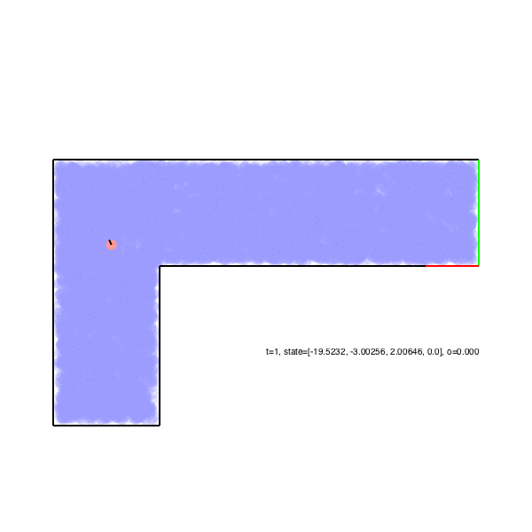

# AA228FinalProject
An example video showing the robot first localizing itself using its bump sensors, then navigating safely to the goal. The Roomba's belief about where it may be located is represented by the blue regions, and is updated using a particle filter.


## Installation
Clone this repository using
```
git clone https://github.com/AutomobilePOMDP/Roomba
```
and `cd` into it.

Then, run the following commands in Julia:
```julia
import POMDPs
POMDPs.add_registry()
```

Enter the package manager by hitting the ```]``` key. Then activate the AA228FinalProject environment with the command:
```
activate .
```
Once activated, your prompt should become:
```
(AA228FinalProject) pkg> 
```
Now run the following command to install all the necessary dependencies:
```
instantiate
```
Note: if you're running Windows and have trouble building the POMDPSolve and SARSOP dependencies, don't worry. It shouldn't interfere with you being able to get started. We're looking into whether the build issues can be resolved. 


## Getting Started
Run the ```lidar_roomba.ipynb``` jupyter notebook to become familiar with the Roomba environment. This will walk you through a step-by-step example of how to set up the environment, define a baseline policy, and evaluate the performance of the policy.

Next, familiarize yourself with the source code by examining the files in the ```src``` directory. A brief description of the files is given below:
* ```Roomba.jl``` - defines the package module for this project and includes the necessary import and export statements
* ```roomba_env.jl``` - defines the environment as a POMDPs.jl MDP and POMDP
* ```env_room.jl``` - defines the environment room and rectangles used to define it
* ```line_segment_utils.jl``` - functions for determining whether the Roomba's path interects with a line segment and struct defining line segments
* ```filtering.jl``` - specification of particle filters for the bumper and lidar Roomba environments

## Usage
```julia
# Action Space
max_speed = 2.0
speed_interval = 2.0
max_turn_rate = 1.0
turn_rate_interval = 1.0
action_space = vec([RoombaAct(v, om) for v in 0:speed_interval:max_speed, om in -max_turn_rate:turn_rate_interval:max_turn_rate])

# Bumper Roomba
sensor = Bumper()
pomdp = RoombaPOMDP(sensor=sensor, mdp=RoombaMDP(aspace=action_space));

# Lidar Roomba
sensor = Lidar()
pomdp = RoombaPOMDP(sensor=sensor, mdp=RoombaMDP(config=2, aspace=action_space))

# Discrete Lidar Roomba
cut_points =  exp10.(range(-.5, stop=1.3, length=10))
sensor = DiscreteLidar(cut_points)
pomdp = RoombaPOMDP(sensor=sensor, mdp=RoombaMDP(config=2, aspace=action_space))

# Belief updater
num_particles = 5000 # number of particles in belief
pos_noise_coeff = 0.3 # noise of position in the resampler
ori_noise_coeff = 0.1 # noise of orientation in the resampler

# LidarResampler for lidar sensor
resampler = LidarResampler(num_particles, pomdp, pos_noise_coeff, ori_noise_coeff)
# BumperResampler for bumper sensor
# resampler = BumperResampler(num_particles, pomdp, pos_noise_coeff, ori_noise_coeff)

belief_updater = BasicParticleFilter(pomdp, resampler, num_particles)
```

## Adding additional packages or running files from terminal
If you would like to add additional packages or run files from terminal, please follow the procedure below.
In julia, first enter the package manager by hitting the ```]``` key. Then activate the AA228FinalProject environment by following the instructions in the Installation section. Packages you now add will be added to the AA228FinalProject environment, and if you exit the package manager (by pressing backspace), the code you run while the environment is activated will have access to all packages specified in the ```Project.toml``` file.